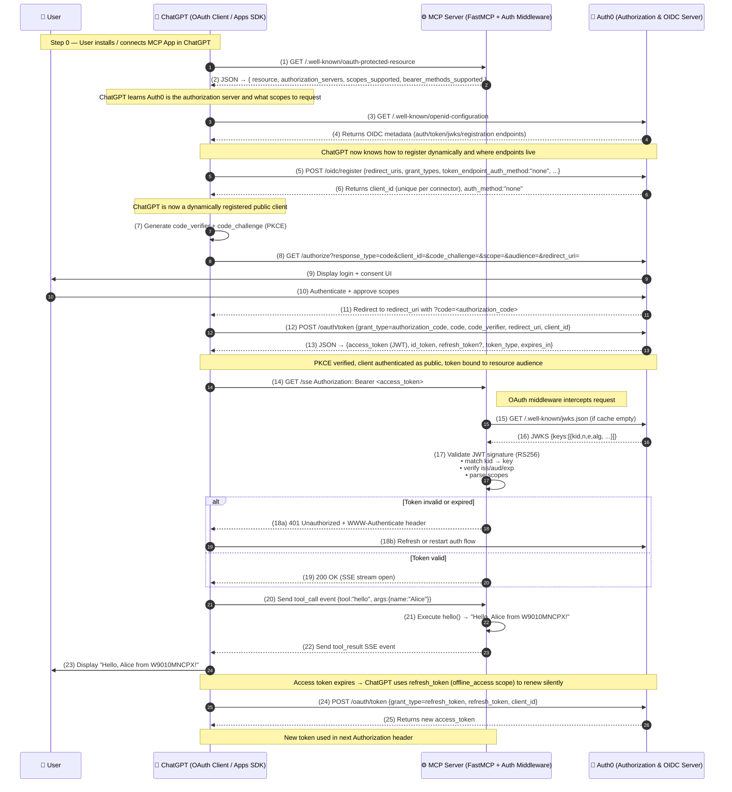

# How to create an App into ChatGPT App SDK

The **new OpenAl Apps SDK** lets developers **bring their products directly into ChatGPT** with <mark>**custom Ul components**</mark>, <mark>**API access**</mark>, and <mark>**user context**</mark> that can persist across chats. 
It's built on Model Context Protocol (**MCP**), which defines **how ChatGPT communicates with our app through** <mark>**tools**</mark>, <mark>**resources**</mark>, and <mark>**structured data**</mark>.

A step-by-step flow of how your OAuth-protected FastMCP server works with ChatGPT and Auth0

- [What OAuth means in the ChatGPT Apps SDKs settings?](https://github.com/adriensieg/OpenAI-ChatGPT-App-SDK-OAuth2.1/blob/master/README.md#what-oauth-means-in-the-chatgpt-apps-sdks-settings)
- [What's the point of using OAuth at all?]()
- [Step-by-step flow of how your OAuth-protected FastMCP server works with ChatGPT and Auth0](https://github.com/adriensieg/OpenAI-ChatGPT-App-SDK-OAuth2.1/tree/master?tab=readme-ov-file#step-by-step-flow-of-how-your-oauth-protected-fastmcp-server-works-with-chatgpt-and-auth0)
    - [Concepts Represented in Flow]()
    - [Mermaid Flow]()
- [Use Cases](https://github.com/adriensieg/OpenAI-ChatGPT-App-SDK-OAuth2.1/blob/master/README.md#use-cases)

## What OAuth means in the ChatGPT Apps SDKs settings?

When ChatGPT gives us the option between **"No Authentication"** and **"OAuth"**, it's referring to *how ChatGPT authenticates itself to our service, ~~not how our end users authenticate to us~~
- **No Authentication**:ChatGPT makes unauthetnicated request to our endpoint
- **OAuth**: ChatGPT will perform an OAuth 2.1 **Client credentials** or **Authorization Code** to obtain an Access token that it will include in requests to our MCP endpoint. \

The **OAuth flow** authenticates ChatGPT (the client) to our MCP service. It does not ~~authenticate~~ or ~~identify the individual human~~ ChatGPT user to us. We won't **receive any user identity** info unless OpenAI explictly passes it. 
OAuth by itself does **not identify a user**; it just delegates authoization. 
    - In *traditional web apps*, you often combine **OAuth + OpenID Connect** (OIDC) to both authenticate and authorize users.
    - In the *ChatGPT SDK integration*, **only OAuth 2.0 is used** — not OIDC. So there's **no user identity payload** (no `ID token`, **no claims about the user**).

#### Conclusion:
- We're authorizing ChatGPT to access your service.
- We're not authenticating ChatGPT users individually.
- Our app sees a single client (ChatGPT), not multiple end-users

### Endpoints to create
- Authorization endpoint (`/authorize`)
- Token endpoint (`/oauth/token`)
- JWKS endpoint (`/.well-known/jwks.json`)
- Registration endpoint (`/oidc/register`) if DCR is enabled
- OIDC discovery (`/.well-known/openid-configuration`)

## Step-by-step flow of how your OAuth-protected FastMCP server works with ChatGPT and Auth0

#### Concepts Represented in Flow

| Concept                                | Description                                                                                                        |
| -------------------------------------- | ------------------------------------------------------------------------------------------------------------------ |
| **OAuth 2.1**                          | Core protocol governing authorization between client, resource owner, and server.                                  |
| **OIDC (OpenID Connect)**              | Identity layer built atop OAuth 2.0—adds ID tokens, discovery, and userinfo.                                       |
| **DCR (Dynamic Client Registration)**  | Allows ChatGPT to register dynamically with Auth0 as a unique OAuth client at runtime.                             |
| **PKCE (Proof Key for Code Exchange)** | Prevents interception of authorization codes; replaces static client secrets for public clients.                   |
| **JWT (JSON Web Token)**               | Self-contained access token signed by Auth0; includes `iss`, `sub`, `aud`, `exp`, `scope`.                         |
| **JWKS (JSON Web Key Set)**            | Auth0’s public keys used by your MCP server to verify token signatures.                                            |
| **RS256 (RSA Signature with SHA-256)** | Algorithm used by Auth0 for signing JWTs—server verifies with public key.                                          |
| **Scopes**                             | Fine-grained permission claims (e.g., `mcp:execute`, `openid`, `profile`, `email`).                                |
| **Bearer Tokens**                      | Access tokens passed in `Authorization: Bearer <token>`; whoever holds them can access.                            |
| **WWW-Authenticate Header**            | Standard 401 response header prompting the client to re-authorize.                                                 |
| **SSE (Server-Sent Events)**           | Long-lived HTTP stream used by FastMCP for bi-directional ChatGPT ↔ MCP communication.                             |
| **Access Token Validation**            | Your middleware verifies JWT signature, audience, issuer, expiration, and scopes.                                  |
| **Refresh Tokens**                     | Long-lived tokens allowing ChatGPT to renew access tokens without user re-login (requires `offline_access` scope). |

## Use Cases
Linkedin Post: 
- Geofencing
- Waiting Time
- Food intent
- Ordering - Stripe Payment
