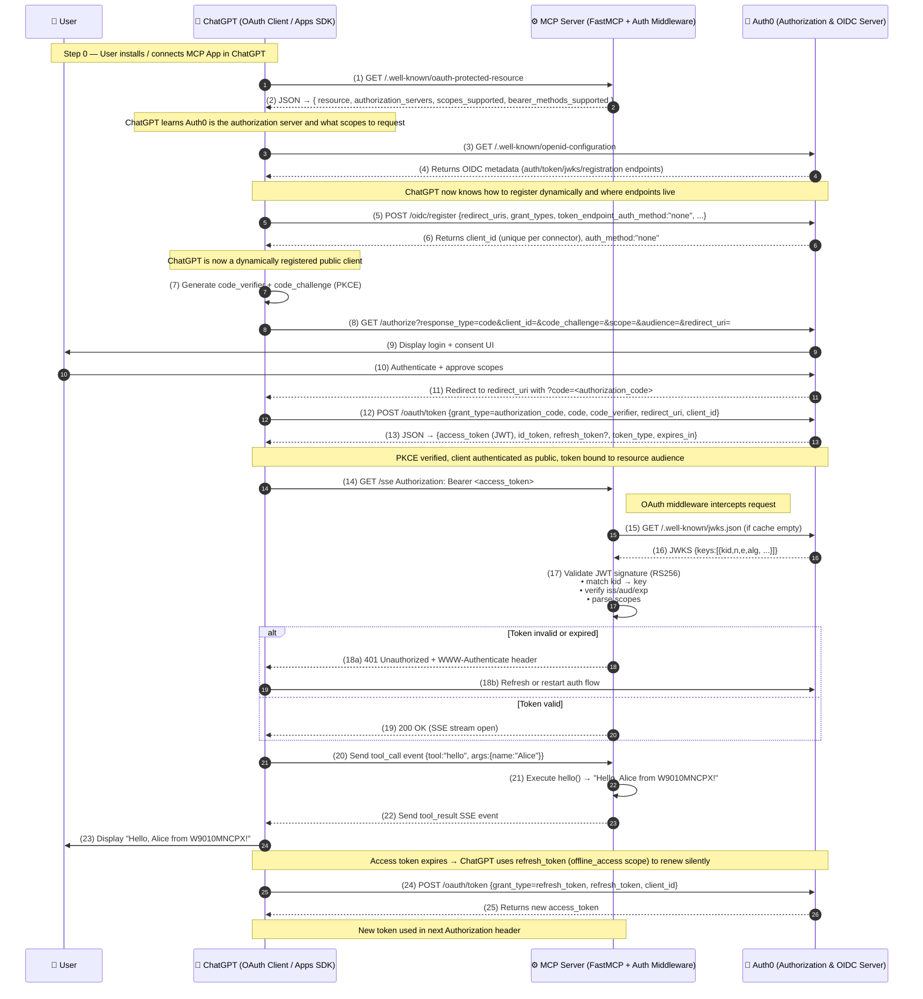

# Create an App into ChatGPT App SDK
Authorization architecture for Chagpt App SDK

```mermaid
sequenceDiagram
    autonumber
    participant U as 🧑 User
    participant C as 💬 ChatGPT (OAuth Client / Apps SDK)
    participant M as ⚙️ MCP Server (FastMCP + Auth Middleware)
    participant A as 🔐 Auth0 (Authorization & OIDC Server)

    Note over U,C: Step 0 — User installs / connects MCP App in ChatGPT

    %% Resource Discovery
    C->>M: (1) GET /.well-known/oauth-protected-resource
    M-->>C: (2) JSON → { resource, authorization_servers, scopes_supported, bearer_methods_supported }
    Note over C: ChatGPT learns Auth0 is the authorization server and what scopes to request

    %% Auth Server Discovery & DCR
    C->>A: (3) GET /.well-known/openid-configuration
    A-->>C: (4) Returns OIDC metadata (auth/token/jwks/registration endpoints)
    Note over C,A: ChatGPT now knows how to register dynamically and where endpoints live

    %% Dynamic Client Registration (DCR)
    C->>A: (5) POST /oidc/register  {redirect_uris, grant_types, token_endpoint_auth_method:"none", ...}
    A-->>C: (6) Returns client_id (unique per connector), auth_method:"none"
    Note over C: ChatGPT is now a dynamically registered public client

    %% Authorization Code Flow with PKCE
    C->>C: (7) Generate code_verifier + code_challenge (PKCE)
    C->>A: (8) GET /authorize?response_type=code&client_id=&code_challenge=&scope=&audience=&redirect_uri=
    A->>U: (9) Display login + consent UI
    U->>A: (10) Authenticate + approve scopes
    A-->>C: (11) Redirect to redirect_uri with ?code=<authorization_code>

    %% Token Exchange
    C->>A: (12) POST /oauth/token {grant_type=authorization_code, code, code_verifier, redirect_uri, client_id}
    A-->>C: (13) JSON → {access_token (JWT), id_token, refresh_token?, token_type, expires_in}
    Note over C,A: PKCE verified, client authenticated as public, token bound to resource audience

    %% Token Usage (Access Protected Resource)
    C->>M: (14) GET /sse  Authorization: Bearer <access_token>
    Note right of M: OAuth middleware intercepts request
    M->>A: (15) GET /.well-known/jwks.json (if cache empty)
    A-->>M: (16) JWKS {keys:[{kid,n,e,alg, ...}]}
    M->>M: (17) Validate JWT signature (RS256)<br/>• match kid → key<br/>• verify iss/aud/exp<br/>• parse scopes
    alt Token invalid or expired
        M-->>C: (18a) 401 Unauthorized + WWW-Authenticate header
        C->>A: (18b) Refresh or restart auth flow
    else Token valid
        M-->>C: (19) 200 OK (SSE stream open)
    end

    %% MCP Tool Execution via SSE
    C->>M: (20) Send tool_call event {tool:"hello", args:{name:"Alice"}}
    M->>M: (21) Execute hello() → "Hello, Alice from W9010MNCPX!"
    M-->>C: (22) Send tool_result SSE event
    C->>U: (23) Display "Hello, Alice from W9010MNCPX!"

    %% Refresh & Lifecycle
    Note over C,A: Access token expires → ChatGPT uses refresh_token (offline_access scope) to renew silently
    C->>A: (24) POST /oauth/token {grant_type=refresh_token, refresh_token, client_id}
    A-->>C: (25) Returns new access_token
    Note over C,M: New token used in next Authorization header

```
