# How to create an App into ChatGPT App SDK?

The **new OpenAl Apps SDK** lets developers **bring their products directly into ChatGPT** with <mark>**custom Ul components**</mark>, <mark>**API access**</mark>, and <mark>**user context**</mark> that can persist across chats. 
It's built on Model Context Protocol (**MCP**), which defines **how ChatGPT communicates with our app through** <mark>**tools**</mark>, <mark>**resources**</mark>, and <mark>**structured data**</mark>.

First - you need to understand the [OAuth flow](https://sagarag.medium.com/how-do-you-discover-the-oauth2-server-configuration-d42d30ad5b9d)

- [**Explain me the flow**](https://github.com/adriensieg/OpenAI-ChatGPT-App-SDK-OAuth2.1/tree/master?tab=readme-ov-file#explain-me-the-code)
- [**Show me the flow**](https://github.com/adriensieg/OpenAI-ChatGPT-App-SDK-OAuth2.1/blob/master/README.md#show-me-the-flow)
  - [Concepts Represented in Flow](https://github.com/adriensieg/OpenAI-ChatGPT-App-SDK-OAuth2.1/blob/master/README.md#concepts-represented-in-flow)
- [**Explain me the code**]
- [**Bibliography**](https://github.com/adriensieg/OpenAI-ChatGPT-App-SDK-OAuth2.1/blob/master/README.md#bibliography)

## Explain me the flow

### 1. Setup / Static configuration (one-time)

<ins>*In Auth0*</ins>
- Created an **Auth0 tenant**.
- Configured an **API (resource)** in Auth0 with **Identifier** (**audience**) = `AUTH0_AUDIENCE`.
- Enabled **DCR (Dynamic Client Registration)** for Auth0.
- Deployed our MCP server to Cloud Run at `MCP_SERVER_URL`.

<ins>*In ChatGPT’s Apps & connectors*</ins>:
- Configured our **connector** with OAuth

Our .env:
```
AUTH0_DOMAIN=dev-rcc43qlv8opam0co.us.auth0.com
AUTH0_AUDIENCE=https://fastmcp-hello-world-311449345351.us-central1.run.app
MCP_SERVER_URL=https://fastmcp-hello-world-311449345351.us-central1.run.app
PORT=8080
```

### 2. Discovery – Resource metadata
<mark>**Goal**: ChatGPT needs to know **who** can *issue tokens* for our resource and **what** *scopes to request*</mark>

- ChatGPT does GET:
```
GET https://fastmcp-hello-world-311449345351.us-central1.run.app/.well-known/oauth-protected-resource
```

Our `oauth_discovery()` handler returns:
```
{
  "resource": "https://fastmcp-hello-world-311449345351.us-central1.run.app",
  "authorization_servers": ["https://dev-rcc43qlv8opam0co.us.auth0.com"],
  "scopes_supported": [
    "openid",
    "profile",
    "email",
    "offline_access",
    "mcp:read",
    "mcp:execute",
    "mcp:clients"
  ],
  "bearer_methods_supported": ["header"]
}
```

From this, <ins>ChatGPT learns</ins>:
- The **resource identifier** (matches audience in tokens).
- The **Auth0 domain** is the **authorization server**.
- It should send **tokens** via **Authorization header**.
- What **scopes** it is allowed to ask for.

### 3. Discovery – Authorization server metadata + DCR
<mark>**Goal**: Now ChatGPT needs to learn **Auth0’s full capabilities** and **register as a client**.</mark>

1. ChatGPT **queries the authorization server’s metadata** (usually via Auth0’s own `/.well-known/openid-configuration` or `/.well-known/oauth-authorization-server`).
   - `authorization_server_metadata()`
   - `openid_configuration()`

*For example*, OIDC discovery:
```

{
  "issuer": "https://dev-rcc43qlv8opam0co.us.auth0.com",
  "authorization_endpoint": "https://dev-rcc43qlv8opam0co.us.auth0.com/authorize",
  "token_endpoint": "https://dev-rcc43qlv8opam0co.us.auth0.com/oauth/token",
  "jwks_uri": "https://dev-rcc43qlv8opam0co.us.auth0.com/.well-known/jwks.json",
  "registration_endpoint": "https://dev-rcc43qlv8opam0co.us.auth0.com/oidc/register",
  "response_types_supported": ["code", ...],
  "grant_types_supported": ["authorization_code", "refresh_token"],
  "scopes_supported": ["openid", "profile", "email", "mcp:read", "mcp:execute"],
  "code_challenge_methods_supported": ["S256"],
  "token_endpoint_auth_methods_supported": [
    "client_secret_basic",
    "client_secret_post",
    "none"
  ],
  ...
}
```

2. **Dynamic Client Registration** (DCR)
    - ChatGPT sends something like:
```
POST https://dev-rcc43qlv8opam0co.us.auth0.com/oidc/register
Content-Type: application/json

{
  "redirect_uris": ["https://chat.openai.com/callback/..."],
  "grant_types": ["authorization_code", "refresh_token"],
  "response_types": ["code"],
  "token_endpoint_auth_method": "none",
  "application_type": "web",
  "client_name": "ChatGPT <Your MCP Connector Name>",
  "scope": "openid profile email offline_access mcp:execute mcp:read"
}
```

Auth0 returns:
```
{
  "client_id": "some-generated-id",
  "client_secret": null,
  "token_endpoint_auth_method": "none",
  "redirect_uris": [...],
  ...
}
```
3. ChatGPT stores this `client_id` and uses it for all **future authorization requests** for that connector.

### 4. Authorization Code flow with PKCE (user connects our app)

Now a user in ChatGPT clicks “Connect” to our app.
    
1. ChatGPT prepares **PKCE**:
    - Generate `code_verifier` (random 43–128 chars).
    - Compute `code_challenge = BASE64URL(SHA256(code_verifier))`.

2. ChatGPT opens the browser to **Auth0’s authorization endpoint**:

```
GET https://dev-rcc43qlv8opam0co.us.auth0.com/authorize
    ?response_type=code
    &client_id=<client_id from DCR>
    &redirect_uri=https://chat.openai.com/.../oauth/callback
    &scope=openid profile email offline_access mcp:execute mcp:read
    &audience=https://fastmcp-hello-world-311449345351.us-central1.run.app
    &state=<random-state>
    &nonce=<random-nonce>
    &code_challenge=<pkce-challenge>
    &code_challenge_method=S256
```

3. User **login** + **consent**
    - Auth0 displays **login page**.
    - User **authenticates** (password, social, etc.).
    - Auth0 shows **consent** for requested scopes/audience.

4. Redirect back to ChatGPT. If user approves, Auth0 redirects to:

```
GET https://chat.openai.com/.../oauth/callback
    ?code=<authorization_code>
    &state=<same-state>
```

5. **Token exchange** - ChatGPT sends `POST` to **token endpoint**:
```
POST https://dev-rcc43qlv8opam0co.us.auth0.com/oauth/token
Content-Type: application/x-www-form-urlencoded

grant_type=authorization_code&
    client_id=<client_id>&
    code=<authorization_code>&
    redirect_uri=https://chat.openai.com/.../oauth/callback&
    code_verifier=<original-pkce-code-verifier>
```

- Auth0 **verifies**:
    - `code` is valid, unexpired, bound to this client + redirect URI
    - `code_verifier` -> code_challenge
    - `audience` (in original auth request) matches configured API
- and then Auth0 **issues**:
```
{
  "access_token": "<access-token-jwt>",
  "refresh_token": "<optional-refresh-token>",
  "id_token": "<id-token-jwt>",
  "token_type": "Bearer",
  "expires_in": 3600
}
```

6. **ChatGPT stores tokens for this user + connector**.

From now on, ChatGPT can **call our MCP server with Authorization**: `Bearer <access_token>` until it expires, then use `refresh tokens` or re-do the flow.

### 5. Calling your MCP tools over SSE

User types something like: “Use my Hello MCP app to say hi to Adrien.”

1. ChatGPT opens or reuses an SSE connection to our MCP endpoint:
```
GET https://fastmcp-hello-world-311449345351.us-central1.run.app/sse
Authorization: Bearer <access_token>
Accept: text/event-stream
```

2. Our FastMCP runtime recognizes a new transport session and starts the MCP protocol over SSE.
3. ChatGPT sends a tool call event:

```
{
  "type": "tool_call",
  "tool": "hello",
  "arguments": { "name": "Alice" }
}
```

4. Our server:
    - Should **validate the access token** via our **middleware** (`extract_and_validate_token`/`validate_token`).
    - If token valid and scopes sufficient (`mcp:execute`), proceed.
    - FastMCP calls our Python function:

```
hello(name="Adrien")  # -> "Hello, Adrien from W9010MNCPX!"
```

- Our server sends back an **SSE event**:
```
{
  "type": "tool_result",
  "tool": "hello",
  "result": "Hello, Adrien from W9010MNCPX!"
}
```
ChatGPT uses that to continue its reasoning and respond to the user.

### 6.Token expiration and re-authorization

If access token expired / invalid:
- Our middleware detects that (`validate_token` fails, or `exp` in the past).
- Our endpoint responds:
  
```
HTTP/1.1 401 Unauthorized
WWW-Authenticate: Bearer realm="mcp-server",
                  authorization_uri="https://dev-rcc43qlv8opam0co.us.auth0.com/authorize",
                  error="invalid_token"
Content-Type: application/json

{
  "error": "unauthorized",
  "error_description": "Invalid or missing access token"
}
```

- ChatGPT sees the `401` with `WWW-Authenticate` and knows it must re-authenticate:
    - Possibly using refresh token.
    - Or by re-running the authorization code flow with user if needed.

## Show me the flow

```mermaid
sequenceDiagram
    autonumber
    participant U as 🧑 User
    participant C as 💬 ChatGPT (OAuth Client / Apps SDK)
    participant M as ⚙️ MCP Server (FastMCP + Auth Middleware)
    participant A as 🔐 Auth0 (Authorization & OIDC Server)

    Note over U,C: Step 0 — User installs / connects MCP App in ChatGPT

    %% Resource Discovery
    C->>M: (1) GET /.well-known/oauth-protected-resource
    M-->>C: (2) JSON → { resource, authorization_servers, scopes_supported, bearer_methods_supported }
    Note over C: ChatGPT learns Auth0 is the authorization server and what scopes to request

    %% Auth Server Discovery & DCR
    C->>A: (3) GET /.well-known/openid-configuration
    A-->>C: (4) Returns OIDC metadata (auth/token/jwks/registration endpoints)
    Note over C,A: ChatGPT now knows how to register dynamically and where endpoints live

    %% Dynamic Client Registration (DCR)
    C->>A: (5) POST /oidc/register  {redirect_uris, grant_types, token_endpoint_auth_method:"none", ...}
    A-->>C: (6) Returns client_id (unique per connector), auth_method:"none"
    Note over C: ChatGPT is now a dynamically registered public client

    %% Authorization Code Flow with PKCE
    C->>C: (7) Generate code_verifier + code_challenge (PKCE)
    C->>A: (8) GET /authorize?response_type=code&client_id=&code_challenge=&scope=&audience=&redirect_uri=
    A->>U: (9) Display login + consent UI
    U->>A: (10) Authenticate + approve scopes
    A-->>C: (11) Redirect to redirect_uri with ?code=<authorization_code>

    %% Token Exchange
    C->>A: (12) POST /oauth/token {grant_type=authorization_code, code, code_verifier, redirect_uri, client_id}
    A-->>C: (13) JSON → {access_token (JWT), id_token, refresh_token?, token_type, expires_in}
    Note over C,A: PKCE verified, client authenticated as public, token bound to resource audience

    %% Token Usage (Access Protected Resource)
    C->>M: (14) GET /sse  Authorization: Bearer <access_token>
    Note right of M: OAuth middleware intercepts request
    M->>A: (15) GET /.well-known/jwks.json (if cache empty)
    A-->>M: (16) JWKS {keys:[{kid,n,e,alg, ...}]}
    M->>M: (17) Validate JWT signature (RS256)<br/>• match kid → key<br/>• verify iss/aud/exp<br/>• parse scopes
    alt Token invalid or expired
        M-->>C: (18a) 401 Unauthorized + WWW-Authenticate header
        C->>A: (18b) Refresh or restart auth flow
    else Token valid
        M-->>C: (19) 200 OK (SSE stream open)
    end

    %% MCP Tool Execution via SSE
    C->>M: (20) Send tool_call event {tool:"hello", args:{name:"Alice"}}
    M->>M: (21) Execute hello() → "Hello, Alice from W9010MNCPX!"
    M-->>C: (22) Send tool_result SSE event
    C->>U: (23) Display "Hello, Alice from W9010MNCPX!"

    %% Refresh & Lifecycle
    Note over C,A: Access token expires → ChatGPT uses refresh_token (offline_access scope) to renew silently
    C->>A: (24) POST /oauth/token {grant_type=refresh_token, refresh_token, client_id}
    A-->>C: (25) Returns new access_token
    Note over C,M: New token used in next Authorization header

```


#### Concepts Represented in Flow

| Concept                                | Description                                                                                                        |
| -------------------------------------- | ------------------------------------------------------------------------------------------------------------------ |
| **OAuth 2.1**                          | Core protocol governing authorization between client, resource owner, and server.                                  |
| **OIDC (OpenID Connect)**              | Identity layer built atop OAuth 2.0—adds ID tokens, discovery, and userinfo.                                       |
| **DCR (Dynamic Client Registration)**  | Allows ChatGPT to register dynamically with Auth0 as a unique OAuth client at runtime.                             |
| **PKCE (Proof Key for Code Exchange)** | Prevents interception of authorization codes; replaces static client secrets for public clients.                   |
| **JWT (JSON Web Token)**               | Self-contained access token signed by Auth0; includes `iss`, `sub`, `aud`, `exp`, `scope`.                         |
| **JWKS (JSON Web Key Set)**            | Auth0’s public keys used by your MCP server to verify token signatures.                                            |
| **RS256 (RSA Signature with SHA-256)** | Algorithm used by Auth0 for signing JWTs—server verifies with public key.                                          |
| **Scopes**                             | Fine-grained permission claims (e.g., `mcp:execute`, `openid`, `profile`, `email`).                                |
| **Bearer Tokens**                      | Access tokens passed in `Authorization: Bearer <token>`; whoever holds them can access.                            |
| **WWW-Authenticate Header**            | Standard 401 response header prompting the client to re-authorize.                                                 |
| **SSE (Server-Sent Events)**           | Long-lived HTTP stream used by FastMCP for bi-directional ChatGPT ↔ MCP communication.                             |
| **Access Token Validation**            | Your middleware verifies JWT signature, audience, issuer, expiration, and scopes.                                  |
| **Refresh Tokens**                     | Long-lived tokens allowing ChatGPT to renew access tokens without user re-login (requires `offline_access` scope). |

## Explain me the code


##### Endpoints to create
- Authorization endpoint (`/authorize`)
- Token endpoint (`/oauth/token`)
- JWKS endpoint (`/.well-known/jwks.json`)
- Registration endpoint (`/oidc/register`) if DCR is enabled
- OIDC discovery (`/.well-known/openid-configuration`)


## Bibliography

- **Authentication patterns for Apps SDK apps**
    - https://developers.openai.com/apps-sdk/build/auth
    - https://stytch.com/blog/guide-to-authentication-for-the-openai-apps-sdk/ 

- **OpenAI Apps SDK: Build Native Apps Inside ChatGPT**
    - https://www.premieroctet.com/blog/en/openai-apps-sdk-build-native-apps-inside-chatgpt 

- **Build Your First ChatGPT App: Fantasy Premier League AI Assistant (Apps SDK Tutorial)**
    - https://www.youtube.com/watch?app=desktop&v=SZNWsaVFaJA
    - https://github.com/hollaugo/tutorials/tree/main/fpl-deepagent 

- **Using Stytch for Remote MCP Server authorization**
    - https://stytch.com/docs/guides/connected-apps/mcp-server-overview

- **Demo pizza app**
    - https://www.linkedin.com/posts/andrew-hoh_openai-announced-the-apps-sdk-for-building-activity-7382840860943523840-L0dM?utm_source=share&utm_medium=member_desktop&rcm=ACoAABNopi8BX8O0PNFj-q_e1kL3mqJvQaqy9jM 

- **Dynamic Application Registration**
    - https://www.descope.com/learn/post/dynamic-client-registration

- **Tips to Harden OAuth Dynamic Client Registration in MCP Servers**
    - https://www.descope.com/blog/post/dcr-hardening-mcp
      
- **How to register and manage OAuth2 clients?**
    - https://sagarag.medium.com/how-to-register-and-manage-oauth2-clients-896e553b7cf1
      
- **ChatGPT App SDK & MCP Developer Mode MCP - Complete Tutorial**
    - https://gist.github.com/ruvnet/7b6843c457822cbcf42fc4aa635eadbb#file-dev-mode-md
    - https://gadget.dev/blog/everything-you-need-to-know-about-building-chatgpt-apps
    - https://github.com/ComposioHQ/awesome-openai-apps-sdk-examples/tree/master/python
